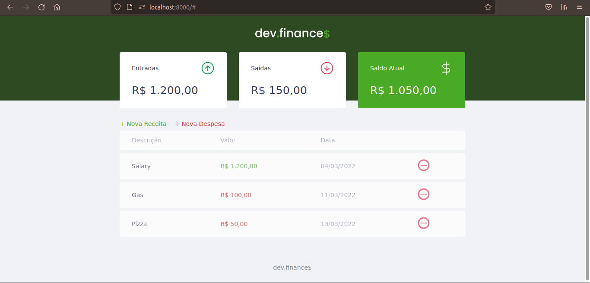
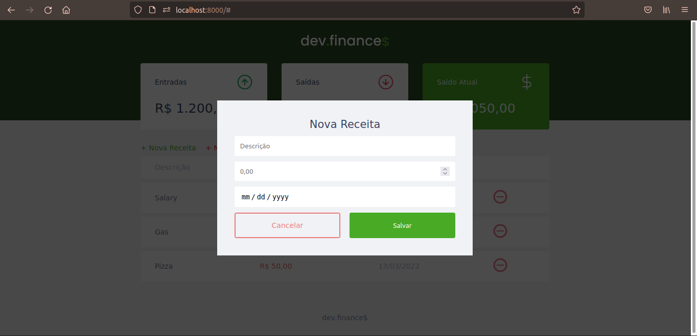

# Dev Finance
This front-end app allows the users to manage their expenses and earnings with a simple interface

## Preview



## Installation
*Download ZIP:*
- On this page go to **Code > Download ZIP**
- Extract the ZIP file

**OR**

*Clone*:
```bash
git clone <URL>
```
## Usage
- Open the project directory
- Open the *index.html* with any browser
